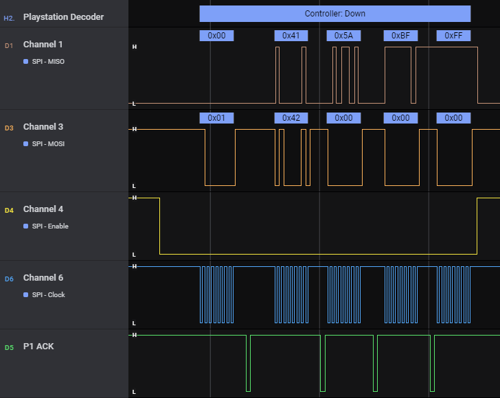

# Playstation Decoder

This extension decodes the SPI format used to communicate between the Playstation console and controllers.

Its primary use is to decode and verify the outputs of controllers.

### Current Limitations

* Only digital controllers can be decoded at this time.

## Settings

This extension requires a SPI analyzer with all proper signals (SS, SCK, MISO, MOSI) mapped correctly.

The Playstation controller has an additional ACK signal, which is not relevant for this extension.

## Running the Extension

After selecting the SPI analyzer, the Playstation Decoder extension will annotate packets accordingly.

A typical packet will read `Controller:` followed by the buttons that are pressed.

Memory cards are identified, but their packets are not decoded and this is outside the scope of this extension.

## Special Thanks

The wonderful guide at [Curious Inventor](https://store.curiousinventor.com/guides/PS2) provided a great reference for this project.